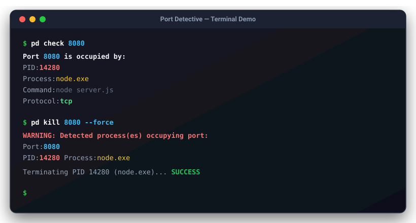

# 🔍 Port Detective

<p align="center">
  <strong>A lightning-fast, cross-platform CLI tool to investigate and terminate processes occupying network ports.</strong>
</p>

<p align="center">
  <a href="https://github.com/Khoa180806/Port_Detective/releases"></a>
  <a href="https://golang.org/"></a>
  <a href="LICENSE"></a>
  <a href="https://github.com/Khoa180806/Port_Detective/actions"></a>
</p>

<p align="center">
  🌐 <strong>English</strong> | <a href="README.vi.md">🇻🇳 Tiếng Việt</a>
</p>

---



---

## 📑 Table of Contents

- [Overview](#-overview)
- [Key Features](#-key-features)
- [Installation](#-installation)
  - [1. Quick Install Script (Zero-Config)](#1-quick-install-script-zero-config)
  - [2. Via Go Install](#2-via-go-install)
  - [3. Pre-built Binaries](#3-pre-built-binaries)
  - [4. Build From Source](#4-build-from-source)
- [Usage & Examples](#-usage--examples)
  - [Check Port (`check`)](#1-check-port-check)
  - [Kill Process (`kill`)](#2-kill-process-kill)
  - [Scan Port Range (`scan`)](#3-scan-port-range-scan)
  - [Language Support (`--lang`)](#4-language-support---lang)
- [Exit Codes](#-exit-codes)
- [Architecture & Design](#-architecture--design)
- [Contributing](#-contributing)
- [License](#-license)

---

## 💡 Overview

Ever seen `Error: listen EADDRINUSE: address already in use :::8080` while starting your dev server?

Finding which zombie process or background service is hoarding your port usually involves remembering convoluted OS commands (`netstat -ano | findstr`, `lsof -i :8080`, `kill -9`). **Port Detective** eliminates this frustration with a unified, elegant command:

```bash
pd check 8080
pd kill 8080 --force
```

---

## ✨ Key Features

- **🚀 Native Cross-Platform**: Purpose-built strategy implementations for Windows (`netstat`/`tasklist`), Linux (`lsof` with `/proc/net` fallback), and macOS (`lsof`).
- **⚡ Blazing Fast**: Zero heavyweight runtimes; compiled to a single lightweight native binary.
- **🛡️ Safe by Default**: Interactive confirmation prompt (`[y/N]`) and `--dry-run` mode before terminating any process.
- **🎨 Beautiful Terminal UI**: High-contrast syntax coloring powered by `fatih/color`.
- **🤖 Machine Friendly**: Full `--json` flag support across all commands for CI/CD and script automation.
- **🌐 Bilingual CLI**: Native support for both English (default) and Vietnamese (`--lang vi` or `PORT_DETECTIVE_LANG=vi`).
- **🔍 Bulk Scanner**: High-throughput concurrent worker pool to scan port ranges in milliseconds.

---

## 📦 Installation

### 1. Quick Install Script (Zero-Config)

Install immediately with one command. Automatically detects OS and chip architecture, sets up binary path, and readies the `pd` command for immediate use:

**Linux & macOS:**
```bash
curl -sSfL https://raw.githubusercontent.com/Khoa180806/Port_Detective/master/scripts/install.sh | sh
```

**Windows (PowerShell):**
```powershell
iwr -useb https://raw.githubusercontent.com/Khoa180806/Port_Detective/master/scripts/install.ps1 | iex
```

---

### 2. Via Go Install

If you have Go installed on your workstation:

```bash
go install github.com/Khoa180806/Port_Detective/cmd/pd@latest
```

*(Ensure `$GOPATH/bin` or `%USERPROFILE%\go\bin` is present in your system `PATH`).*

---

### 3. Pre-built Binaries

Download pre-compiled binaries and checksums from the [GitHub Releases](https://github.com/Khoa180806/Port_Detective/releases) page:

| OS | Architecture | Package Format |
|---|---|---|
| **Windows** | x86_64 / arm64 | `.zip` |
| **Linux** | x86_64 / arm64 | `.tar.gz` |
| **macOS** | x86_64 / Apple Silicon (arm64) | `.tar.gz` |

---

### 4. Build From Source

```bash
git clone https://github.com/Khoa180806/Port_Detective.git
cd Port_Detective
go build -o pd.exe ./cmd/pd    # Windows
# or: go build -o pd ./cmd/pd # Linux/macOS
```

---

## 🚀 Usage & Examples

### 1. Check Port (`check`)

Inspect which process is currently listening on or occupying a port:

```bash
# Human-readable colored output
pd check 8080

# Machine-readable JSON output
pd check 8080 --json
```

**Sample Output:**
```text
Port 8080 is occupied by:
  PID:      14280
  Process:  node.exe
  Command:  node server.js
  Protocol: tcp
```

**Sample JSON Output:**
```json
[
  {
    "pid": 14280,
    "name": "node.exe",
    "command": "node server.js",
    "port": 8080,
    "protocol": "tcp"
  }
]
```

---

### 2. Kill Process (`kill`)

Terminate processes holding a specific port:

```bash
# Interactive mode (prompts for confirmation [y/N])
pd kill 8080

# Force termination without prompt
pd kill 8080 --force

# Preview actions without terminating any process
pd kill 8080 --dry-run
```

---

### 3. Scan Port Range (`scan`)

Concurrently scan a range of ports using an asynchronous worker pool:

```bash
# Scan a range of ports
pd scan 3000-3015

# Export scan results to JSON
pd scan 8000-8080 --json
```

---

### 4. Language Support (`--lang`)

Port Detective supports bilingual output (English and Vietnamese). The default is English:

```bash
# Use English (Default)
pd check 8080

# Switch to Vietnamese via flag
pd --lang vi check 8080
pd --lang vi --help

# Set system-wide via environment variable
export PORT_DETECTIVE_LANG=vi    # Linux/macOS
$env:PORT_DETECTIVE_LANG="vi"    # PowerShell
```

---

## 🚦 Exit Codes

Port Detective conforms to standard Unix exit code conventions:

| Exit Code | Meaning | Description |
|---|---|---|
| `0` | **Success** | Process found (check), process killed (kill), or ports scanned successfully. |
| `1` | **Port Free / No Match** | Port is available (check/scan), or action was cancelled by user. |
| `2` | **Error** | Invalid port number, permission denied, or system command error. |

---

## 🏛️ Architecture & Design

```
port-detective/
├── cmd/
│   ├── pd/main.go            # Primary CLI entry point (pd executable)
│   ├── root.go               # Cobra root command & dynamic i18n hook
│   ├── check.go              # `pd check <port>`
│   ├── kill.go               # `pd kill <port>`
│   └── scan.go               # `pd scan <start>-<end>`
├── internal/
│   ├── i18n/                 # Translation engine (EN / VI message maps)
│   ├── lookup/               # OS Strategy implementations via Go Build Tags
│   │   ├── lookup.go         # PortLookupStrategy interface
│   │   ├── windows.go        # Windows strategy (netstat + tasklist)
│   │   ├── linux.go          # Linux strategy (lsof + /proc/net/tcp fallback)
│   │   └── darwin.go         # macOS strategy (lsof)
│   ├── output/               # High-contrast color text and JSON formatters
│   └── process/              # Core ProcessInfo domain model
├── scripts/                  # Automated install and release scripts
└── docs/                     # Documentation assets and screenshots
```

---

## 🤝 Contributing

Contributions, issues, and feature requests are welcome! Feel free to check the [issues page](https://github.com/Khoa180806/Port_Detective/issues).

1. Fork the Project
2. Create your Feature Branch (`git checkout -b feature/AmazingFeature`)
3. Commit your Changes (`git commit -m 'feat: add some amazing feature'`)
4. Push to the Branch (`git push origin feature/AmazingFeature`)
5. Open a Pull Request

---

## 📄 License

This project is licensed under the MIT License - see the [LICENSE](LICENSE) file for details.
