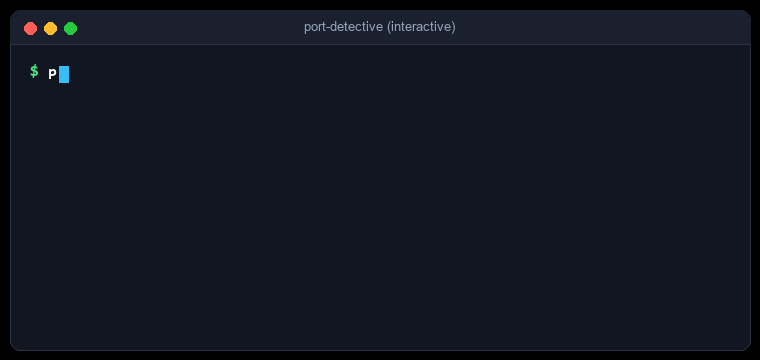
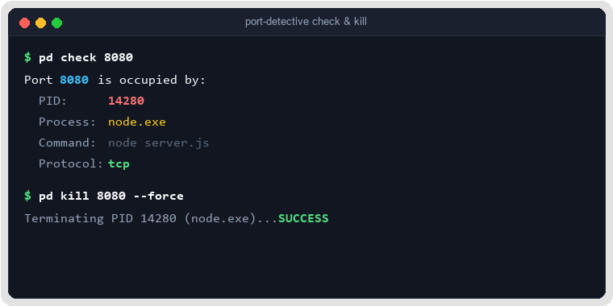
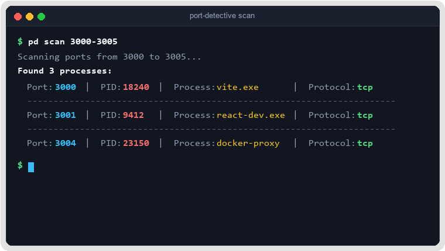

# 🔍 Port Detective

<p align="center">
  <strong>Công cụ dòng lệnh (CLI) siêu tốc, cross-platform giúp tra cứu và dừng (kill) các tiến trình đang chiếm giữ port mạng.</strong>
</p>

<p align="center">
  <a href="https://github.com/Khoa180806/Port_Detective/releases"></a>
  <a href="https://golang.org/"></a>
  <a href="LICENSE"></a>
  <a href="https://github.com/Khoa180806/Port_Detective/actions"></a>
</p>

<p align="center">
  <a href="README.md">🇬🇧 English</a> | 🌐 <strong>Tiếng Việt</strong>
</p>

---

<p align="center">
  
</p>

---

## 📑 Mục lục

- [Tổng quan](#-tổng-quan)
- [Tính năng nổi bật](#-tính-năng-nổi-bật)
- [Cài đặt](#-cài-đặt)
  - [1. Script cài đặt tự động (Dùng ngay, Zero-Config)](#1-script-cài-đặt-tự-động-dùng-ngay-zero-config)
  - [2. Cài đặt qua Go Install](#2-cài-đặt-qua-go-install)
  - [3. Tải Binary biên dịch sẵn](#3-tải-binary-biên-dịch-sẵn)
  - [4. Tự build từ mã nguồn](#4-tự-build-từ-mã-nguồn)
- [Hướng dẫn sử dụng](#-hướng-dẫn-sử-dụng)
  - [Kiểm tra port (`check`)](#1-kiểm-tra-port-check)
  - [Dừng tiến trình (`kill`)](#2-dừng-tiến-trình-kill)
  - [Quét dải port (`scan`)](#3-quét-dải-port-scan)
  - [Hỗ trợ đa ngôn ngữ (`--lang`)](#4-hỗ-trợ-đa-ngôn-ngữ---lang)
- [Quy ước mã thoát (Exit Codes)](#-quy-ước-mã-thoát-exit-codes)
- [Kiến trúc & Thiết kế](#-kiến-trúc--thiết-kế)
- [Đóng góp phát triển](#-đóng-góp-phát-triển)
- [Giấy phép](#-giấy-phép)

---

## 💡 Tổng quan

Đã bao giờ bạn gặp lỗi kinh điển `Error: listen EADDRINUSE: address already in use :::8080` khi khởi động server dự án chưa?

Việc tìm xem tiến trình chạy ngầm nào đang chiếm dụng port thường đòi hỏi phải nhớ những câu lệnh hệ thống phức tạp và dài dòng (`netstat -ano | findstr`, `lsof -i :8080`, `kill -9`). **Port Detective** giúp giải quyết sự phiền toái này chỉ bằng một câu lệnh duy nhất, thanh lịch và nhất quán trên mọi hệ điều hành:

```bash
pd check 8080
pd kill 8080 --force
```

---

## ✨ Tính năng nổi bật

- **🚀 Native Cross-Platform**: Tối ưu riêng cho từng hệ điều hành: Windows (`netstat`/`tasklist`), Linux (`lsof` kèm cơ chế fallback đọc `/proc/net`), và macOS (`lsof`).
- **⚡ Siêu tốc & Nhẹ**: Không cần môi trường máy ảo hay runtime nặng nề; được biên dịch trực tiếp thành một file nhị phân (binary) duy nhất.
- **🛡️ An toàn mặc định**: Tự động hiển thị câu hỏi xác nhận (`[y/N]`) và hỗ trợ chế độ xem trước (`--dry-run`) trước khi dừng bất kỳ tiến trình nào.
- **🎨 Giao diện Terminal đẹp mắt**: Tô màu cú pháp tương phản cao với thư viện `fatih/color`.
- **🤖 Tối ưu cho tự động hóa**: Hỗ trợ cờ `--json` ở tất cả các lệnh để dễ dàng tích hợp vào script CI/CD hoặc pipeline tự động.
- **🌐 Song ngữ chuẩn**: Hỗ trợ đầy đủ tiếng Anh (mặc định) và tiếng Việt tự nhiên (`--lang vi` hoặc `PORT_DETECTIVE_LANG=vi`).
- **🔍 Quét dải port hàng loạt**: Sử dụng Worker Pool bất đồng bộ để quét hàng trăm port trong tích tắc.

---

## 📦 Cài đặt

### 1. Script cài đặt tự động (Dùng ngay, Zero-Config)

Cài đặt tức thì chỉ bằng đúng 1 câu lệnh. Script sẽ tự động nhận diện hệ điều hành và kiến trúc chip máy bạn, tải bản binary chuẩn nhất, đặt vào thư mục trong PATH và kích hoạt lệnh `pd` để sử dụng ngay lập tức:

**Linux & macOS:**
```bash
curl -sSfL https://raw.githubusercontent.com/Khoa180806/Port_Detective/master/scripts/install.sh | sh
```

**Windows (PowerShell):**
```powershell
iwr -useb https://raw.githubusercontent.com/Khoa180806/Port_Detective/master/scripts/install.ps1 | iex
```

---

### 2. Cài đặt qua Go Install

Nếu máy bạn đã cài sẵn môi trường Golang:

```bash
go install github.com/Khoa180806/Port_Detective/cmd/pd@latest
```

*(Đảm bảo thư mục `$GOPATH/bin` hoặc `%USERPROFILE%\go\bin` đã nằm trong biến môi trường `PATH` của máy).*

---

### 3. Tải Binary biên dịch sẵn

Tải file nén binary cùng mã băm checksum tương ứng trực tiếp từ trang [GitHub Releases](https://github.com/Khoa180806/Port_Detective/releases):

| Hệ điều hành | Kiến trúc CPU | Định dạng đóng gói |
|---|---|---|
| **Windows** | x86_64 / arm64 | `.zip` |
| **Linux** | x86_64 / arm64 | `.tar.gz` |
| **macOS** | x86_64 / Apple Silicon (arm64) | `.tar.gz` |

---

### 4. Tự build từ mã nguồn

```bash
git clone https://github.com/Khoa180806/Port_Detective.git
cd Port_Detective
go build -o pd.exe ./cmd/pd    # Trên Windows
# hoặc: go build -o pd ./cmd/pd # Trên Linux/macOS
```

---

## 🚀 Hướng dẫn sử dụng

### 1. Kiểm tra port (`check`)

Kiểm tra xem tiến trình nào đang lắng nghe hoặc chiếm giữ port:

```bash
# Hiển thị trực quan có màu sắc
pd check 8080

# Xuất kết quả dưới định dạng JSON
pd check 8080 --json
```

**Ví dụ đầu ra:**
```text
Port 8080 is occupied by:
  PID:      14280
  Process:  node.exe
  Command:  node server.js
  Protocol: tcp
```

**Ví dụ đầu ra (JSON):**
```json
[
  {
    "pid": 14280,
    "name": "node.exe",
    "command": "node server.js",
    "port": 8080,
    "protocol": "tcp"
  }
]
```

---

### 2. Dừng tiến trình (`kill`)

Dừng (kill) các tiến trình đang chiếm giữ một port cụ thể:

```bash
# Chế độ tương tác (hỏi xác nhận [y/N] trước khi thực hiện)
pd kill 8080

# Buộc dừng ngay lập tức, bỏ qua bước xác nhận
pd kill 8080 --force

# Xem trước các tiến trình sẽ bị dừng mà không thực sự kill
pd kill 8080 --dry-run
```

<p align="center">
  
</p>

---

### 3. Quét dải port (`scan`)

Quét đồng thời một dải port bằng Worker Pool bất đồng bộ tốc độ cao:

```bash
# Quét một dải port
pd scan 3000-3005

# Xuất danh sách port đang mở ra JSON
pd scan 8000-8080 --json
```

<p align="center">
  
</p>

---

### 4. Hỗ trợ đa ngôn ngữ (`--lang`)

Port Detective hỗ trợ song ngữ tiếng Anh và tiếng Việt. Ngôn ngữ mặc định là tiếng Anh:

```bash
# Sử dụng tiếng Anh (Mặc định)
pd check 8080

# Chuyển sang tiếng Việt qua cờ tham số
pd --lang vi check 8080
pd --lang vi --help

# Hoặc thiết lập toàn hệ thống qua biến môi trường
export PORT_DETECTIVE_LANG=vi    # Linux/macOS
$env:PORT_DETECTIVE_LANG="vi"    # Windows PowerShell
```

---

## 🚦 Quy ước mã thoát (Exit Codes)

Port Detective tuân thủ quy ước chuẩn của các công cụ dòng lệnh Unix:

| Mã thoát | Ý nghĩa | Mô tả chi tiết |
|---|---|---|
| `0` | **Thành công** | Tìm thấy tiến trình (`check`), đã kill thành công (`kill`), hoặc quét port hoàn tất. |
| `1` | **Port trống / Hủy lệnh** | Port khả dụng không có ai chiếm, hoặc thao tác bị hủy bởi người dùng. |
| `2` | **Lỗi** | Số port không hợp lệ, không đủ quyền truy cập, hoặc lỗi lệnh hệ thống. |

---

## 🏛️ Kiến trúc & Thiết kế

```
port-detective/
├── cmd/
│   ├── pd/main.go            # Entry point chính của ứng dụng (sinh ra binary "pd")
│   ├── root.go               # Cobra root command & cơ chế i18n hook động
│   ├── check.go              # Lệnh `pd check <port>`
│   ├── kill.go               # Lệnh `pd kill <port>`
│   └── scan.go               # Lệnh `pd scan <start>-<end>`
├── internal/
│   ├── i18n/                 # Translation engine (bản đồ từ điển EN / VI)
│   ├── lookup/               # Triển khai OS Strategy qua Go Build Tags
│   │   ├── lookup.go         # Interface PortLookupStrategy & dispatch
│   │   ├── windows.go        # Strategy Windows (netstat + tasklist)
│   │   ├── linux.go          # Strategy Linux (lsof + fallback /proc/net/tcp)
│   │   └── darwin.go         # Strategy macOS (lsof)
│   ├── output/               # Formatter xuất text màu sắc tương phản cao và JSON
│   └── process/              # Core Domain Model struct ProcessInfo
├── scripts/                  # Script tự động cài đặt (install.sh, install.ps1) & release
└── docs/                     # Tài liệu minh họa, hình ảnh và demo SVG/GIF
```

---

## 🤝 Đóng góp phát triển

Mọi đóng góp, báo cáo lỗi hoặc đề xuất tính năng mới đều được hoan nghênh nhiệt tình! Bạn có thể tạo issue tại [trang Issues](https://github.com/Khoa180806/Port_Detective/issues).

1. Fork dự án về tài khoản của bạn
2. Tạo nhánh tính năng mới (`git checkout -b feature/TinhNangMoi`)
3. Commit các thay đổi (`git commit -m 'feat: them tinh nang tuyet voi'`)
4. Đẩy lên nhánh của bạn (`git push origin feature/TinhNangMoi`)
5. Mở một Pull Request

---

## 📄 Giấy phép

Dự án được phân phối dưới giấy phép mã nguồn mở MIT License - xem file [LICENSE](LICENSE) để biết thêm chi tiết.
