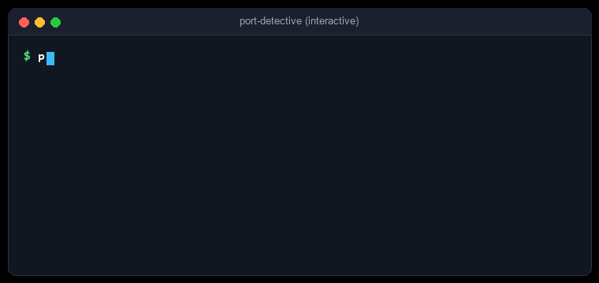
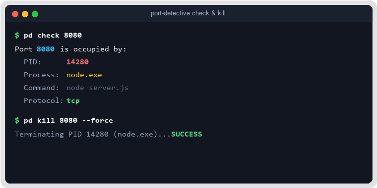
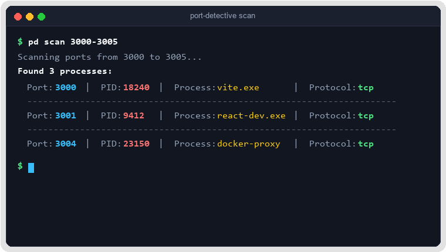

# 🔍 Port Detective

<div align="center">

<h3>Công cụ dòng lệnh (CLI) siêu tốc, cross-platform giúp tra cứu và giải phóng các port mạng đang bị chiếm dụng.</h3>

<p align="center">
  <a href="https://port-detective.vercel.app"></a>
  <a href="https://github.com/Khoa180806/Port_Detective/releases"></a>
  <a href="https://golang.org/"></a>
  <a href="LICENSE"></a>
  <a href="https://github.com/Khoa180806/Port_Detective/actions"></a>
</p>

<p align="center">
  <a href="README.md">🇬🇧 English</a> · 🌐 <strong>Tiếng Việt</strong> · 🚀 <a href="https://port-detective.vercel.app"><strong>Xem Web App</strong></a> · 📖 <a href="docs/cli-reference.md"><strong>Tài liệu Docs</strong></a>
</p>

</div>

---

<div align="center">
  
</div>

---

## 📑 Mục lục

- [⚡ Khởi động nhanh trong 30 giây](#-khởi-động-nhanh-trong-30-giây)
- [🚀 Tính năng nổi bật](#-tính-năng-nổi-bật)
- [📦 Hướng dẫn cài đặt](#-hướng-dẫn-cài-đặt)
  - [Cách 1: Script cài đặt tự động (Khuyên dùng)](#cách-1-script-cài-đặt-tự-động-khuyên-dùng)
  - [Cách 2: Cài đặt qua Go Toolchain](#cách-2-cài-đặt-qua-go-toolchain)
  - [Cách 3: Tải file binary trực tiếp từ GitHub Releases](#cách-3-tải-file-binary-trực-tiếp-từ-github-releases)
- [🛠️ Trải nghiệm các câu lệnh](#️-trải-nghiệm-các-câu-lệnh)
  - [1. `pd check <port>`](#1-pd-check-port)
  - [2. `pd kill <port>`](#2-pd-kill-port)
  - [3. `pd scan <start-port>-<end-port>`](#3-pd-scan-start-port-end-port)
- [📐 Sơ đồ kiến trúc hệ thống](#-sơ-đồ-kiến-trúc-hệ-thống)
- [📚 Trung tâm tài liệu (Documentation Hub)](#-trung-tâm-tài-liệu-documentation-hub)
- [🚦 Mã thoát chuẩn (POSIX Exit Codes)](#-mã-thoát-chuẩn-posix-exit-codes)
- [📄 Giấy phép](#-giấy-phép)

---

## ⚡ Khởi động nhanh trong 30 giây

Bạn gặp lỗi kinh điển `Error: listen EADDRINUSE: address already in use :::8080` khi khởi chạy dev server? Xử lý ngay chỉ với vài thao tác ngắn gọn:

```bash
# 1. Cài đặt tự động qua script một dòng lệnh
curl -sSfL https://raw.githubusercontent.com/Khoa180806/Port_Detective/master/scripts/install.sh | sh

# 2. Kiểm tra tiến trình nào đang chiếm giữ port 8080
pd check 8080

# 3. Dừng tiến trình và giải phóng port
pd kill 8080 --force
```

---

## 🚀 Tính năng nổi bật

| Điểm mạnh | Chi tiết kỹ thuật |
| :--- | :--- |
| **🚀 Native Cross-Platform** | Tối ưu chuyên biệt cho từng hệ điều hành: Windows (`netstat`/`tasklist`), Linux (`lsof` với cơ chế fallback đọc `/proc/net`), và macOS (`lsof`). |
| **⚡ Siêu tốc & Nhẹ** | Không phụ thuộc runtime nặng (không cần Node.js, Python, JVM). Biên dịch thành 1 file nhị phân duy nhất, khởi động trong vài mili-giây. |
| **🛡️ An toàn mặc định** | Luôn yêu cầu xác nhận trước khi kill (`[y/N]`), hỗ trợ chế độ xem trước an toàn `--dry-run`, bảo vệ tiến trình hệ thống trọng yếu. |
| **🎨 Giao diện Terminal trực quan** | Bảng hiển thị thông tin rõ ràng, tô màu cú pháp tương phản cao với `fatih/color`. |
| **🤖 Sẵn sàng cho CI/CD** | Cờ `--json` hỗ trợ đầy đủ trên tất cả câu lệnh, giúp dễ dàng tích hợp vào script bash, PowerShell hoặc lệnh `jq`. |
| **🌐 Song ngữ tích hợp** | Chuyển đổi linh hoạt giữa tiếng Anh và tiếng Việt (`--lang vi` hoặc biến môi trường `PORT_DETECTIVE_LANG=vi`). |
| **🔍 Quét dải port tốc độ cao** | Sử dụng worker pool goroutine bất đồng bộ để quét hàng ngàn port trong tích tắc. |

---

## 📦 Hướng dẫn cài đặt

### Cách 1: Script cài đặt tự động (Khuyên dùng)

Tự động nhận diện hệ điều hành và kiến trúc CPU, tải bản phát hành phù hợp, kiểm tra mã băm checksum và cấu hình biến môi trường `PATH`:

<table>
<tr>
<td><b>Linux & macOS</b></td>
<td><b>Windows (PowerShell)</b></td>
</tr>
<tr>
<td>

```bash
curl -sSfL https://raw.githubusercontent.com/Khoa180806/Port_Detective/master/scripts/install.sh | sh
```

</td>
<td>

```powershell
iwr -useb https://raw.githubusercontent.com/Khoa180806/Port_Detective/master/scripts/install.ps1 | iex
```

</td>
</tr>
</table>

### Cách 2: Cài đặt qua Go Toolchain
```bash
go install github.com/Khoa180806/Port_Detective/cmd/pd@latest
```

### Cách 3: Tải file binary trực tiếp từ GitHub Releases
Tải bản phát hành mới nhất từ [GitHub Releases](https://github.com/Khoa180806/Port_Detective/releases):
- **Windows:** `port-detective_Windows_x86_64.zip` / `arm64.zip`
- **Linux:** `port-detective_Linux_x86_64.tar.gz` / `arm64.tar.gz`
- **macOS:** `port-detective_Darwin_x86_64.tar.gz` / `arm64.tar.gz`

---

## 🛠️ Trải nghiệm các câu lệnh

### 1. `pd check <port>`
Kiểm tra thông tin tiến trình đang chiếm port dạng bảng màu hoặc JSON:

```bash
pd check 8080
```
```text
Port 8080 is occupied by:
  PID:      14280
  Process:  node.exe
  Command:  node server.js
  Protocol: tcp
```

```bash
pd check 8080 --json
```
```json
[
  {
    "pid": 14280,
    "name": "node.exe",
    "command": "node server.js",
    "port": 8080,
    "protocol": "tcp"
  }
]
```

### 2. `pd kill <port>`
Dừng tiến trình đang chiếm giữ port:

```bash
# Chế độ tương tác (hỏi xác nhận trước):
pd kill 8080

# Buộc dừng tức thì không cần hỏi:
pd kill 8080 --force

# Chạy thử nghiệm xem trước, không can thiệp tiến trình:
pd kill 8080 --dry-run
```

<div align="center">
  
</div>

### 3. `pd scan <start-port>-<end-port>`
Quét đồng thời một dải port bằng worker pool:

```bash
pd scan 3000-3005
```
```text
Scanning ports from 3000 to 3005...
Found 2 processes:
  Port:     3000
  PID:      18204
  Process:  node.exe
  Command:  node.exe
  Protocol: tcp
--------------------------------------------------
  Port:     3003
  PID:      9142
  Process:  docker-proxy
  Command:  docker-proxy
  Protocol: tcp
```

<div align="center">
  
</div>

---

## 📐 Sơ đồ kiến trúc hệ thống

Port Detective áp dụng Go Build Tags và Strategy Pattern để phân nhánh thực thi đa nền tảng ngay từ lúc biên dịch:

<div align="center">


</div>

> [!NOTE]
> Để tìm hiểu chi tiết về cơ chế đọc `/proc/net/tcp` trên Linux kernel, kỹ thuật phân tích `netstat` trên Windows và worker pool concurrency, bạn có thể tham khảo [Tài liệu Kiến trúc](docs/architecture.md).

---

## 📚 Trung tâm tài liệu (Documentation Hub)

Toàn bộ tài liệu chi tiết được lưu trữ trong thư mục [`docs/`](docs/):

| Tài liệu | Nội dung chính |
| :--- | :--- |
| [📐 **System Architecture**](docs/architecture.md) | Thiết kế module, cơ chế Go build tags, và mô hình concurrency |
| [📖 **CLI Reference Guide**](docs/cli-reference.md) | Cú pháp chi tiết các câu lệnh, danh sách flag tham số và mã thoát |
| [📦 **Installation Guide**](docs/installation.md) | Hướng dẫn cài đặt đa nền tảng, thiết lập quyền hạn và biến PATH |
| [🤝 **Contributing Guide**](docs/contributing.md) | Môi trường phát triển, chạy unit test và quy trình gửi Pull Request |

---

## 🚦 Mã thoát chuẩn (POSIX Exit Codes)

| Mã | Trạng thái | Ý nghĩa |
| :---: | :--- | :--- |
| `0` | **Thành công** | Đã tìm thấy tiến trình, đã kill thành công, hoặc quét hoàn tất |
| `1` | **Port trống / Hủy thao tác** | Port đang khả dụng, hoặc người dùng từ chối xác nhận kill (`n`) |
| `2` | **Không đủ quyền hạn** | Thiếu quyền Administrator hoặc `sudo` để can thiệp tiến trình |
| `3` | **Tham số không hợp lệ** | Port ngoài dải `1-65535` hoặc dải scan sai định dạng |
| `4` | **Lỗi hệ thống** | Lỗi trong quá trình thực thi lệnh OS |

---

## 📄 Giấy phép

Dự án được phân phối theo giấy phép mã nguồn mở MIT License — xem file [LICENSE](LICENSE) để biết thêm chi tiết.
