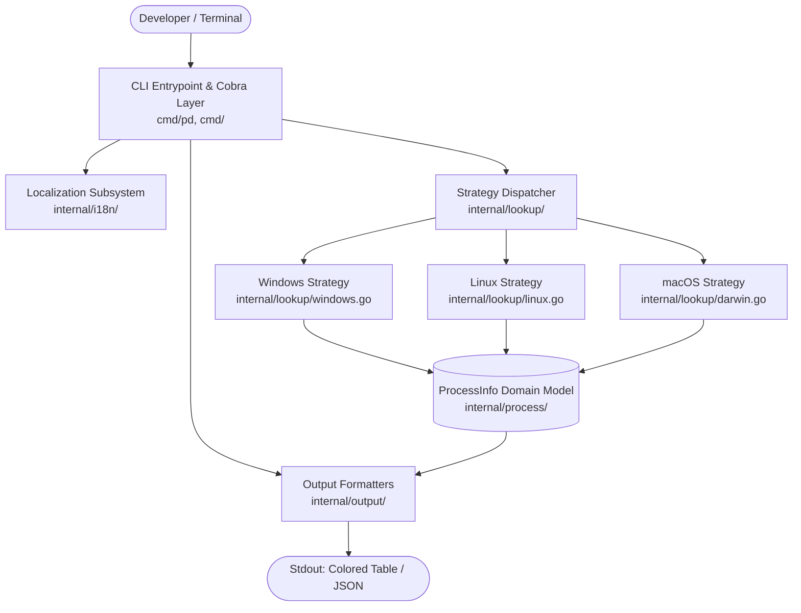
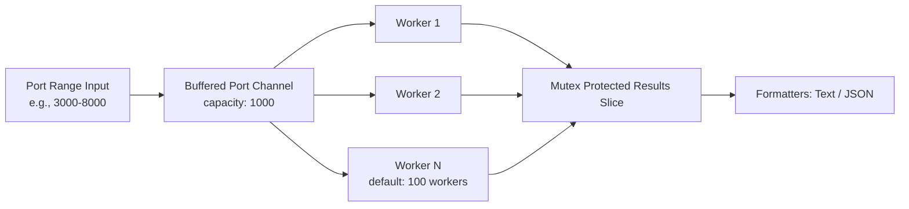

# Architecture

This document describes the software layers, component boundaries, and request execution flow of Port Detective.

---

## 1. High-Level Architectural Layers

Port Detective uses a 4-tier modular architecture designed for instant startup and zero external runtime dependencies.



- **Entrypoint Layer (`cmd/pd/`, `cmd/`)**: Parses command flags, validates inputs, and coordinates subcommands using `spf13/cobra`.
  *(source: [cmd/pd/main.go](file:///d:/Project/PortDetective/cmd/pd/main.go), [cmd/root.go](file:///d:/Project/PortDetective/cmd/root.go))*
- **Localization Layer (`internal/i18n/`)**: In-memory dictionary maps providing English (`en`) and Vietnamese (`vi`) text strings.
  *(source: [internal/i18n/i18n.go](file:///d:/Project/PortDetective/internal/i18n/i18n.go))*
- **Lookup Strategy Layer (`internal/lookup/`)**: OS-specific socket-to-process discovery and process termination via compile-time Go build tags.
  *(source: [internal/lookup/lookup.go](file:///d:/Project/PortDetective/internal/lookup/lookup.go))*
- **Presentation Layer (`internal/output/`)**: Renders data models to stdout in colorized terminal tables or JSON arrays.
  *(source: [internal/output/text.go](file:///d:/Project/PortDetective/internal/output/text.go), [internal/output/json.go](file:///d:/Project/PortDetective/internal/output/json.go))*

---

## 2. Component Design & Abstraction Boundary

### 2.1 Domain Model (`internal/process`)
The core data structure bridging lookup strategies and output renderers is `ProcessInfo`:

```go
type ProcessInfo struct {
    PID      int    `json:"pid"`
    Name     string `json:"name"`
    Command  string `json:"command"`
    Port     int    `json:"port"`
    Protocol string `json:"protocol"` // "tcp" | "udp"
}
```
*(source: [internal/process/process.go](file:///d:/Project/PortDetective/internal/process/process.go))*

### 2.2 Cross-Platform Strategy Interface (`internal/lookup`)
Compile-time Go build tags (`//go:build <os>`) instantiate the target operating system implementation:

```go
type PortLookupStrategy interface {
    FindProcessByPort(port int) ([]process.ProcessInfo, error)
    KillProcess(pid int) error
}
```
*(source: [internal/lookup/lookup.go](file:///d:/Project/PortDetective/internal/lookup/lookup.go))*

| Operating System | Strategy File | Primary Query Mechanism | Fallback Mechanism | Process Kill Method |
| :--- | :--- | :--- | :--- | :--- |
| **Windows** | `windows.go` (`//go:build windows`) | `netstat -ano` | `tasklist /FO CSV /FI "PID eq <pid>"` | `taskkill /F /PID <pid>` |
| **Linux** | `linux.go` (`//go:build linux`) | `lsof -i :<port> -sTCP:LISTEN -P -n` | Direct kernel `/proc/net/tcp` inode parsing & `/proc/<pid>/fd/` inspection | `syscall.Kill(pid, syscall.SIGKILL)` |
| **macOS** | `darwin.go` (`//go:build darwin`) | `lsof -i :<port> -P -n` | `ps -p <pid> -o comm=` | `syscall.Kill(pid, syscall.SIGKILL)` |

---

## 3. Concurrency Model (`cmd/scan.go`)

The `pd scan <start>-<end>` command coordinates an asynchronous worker pool using bounded Go channels:



- **Worker Concurrency**: Defaults to 100 concurrent workers.
- **Port Probing**: Performs rapid TCP handshake dials before initiating process resolution to minimize system calls.
- **Thread Safety**: Aggregates discovered active ports with mutex locks to eliminate output race conditions.
*(source: [cmd/scan.go](file:///d:/Project/PortDetective/cmd/scan.go))*
