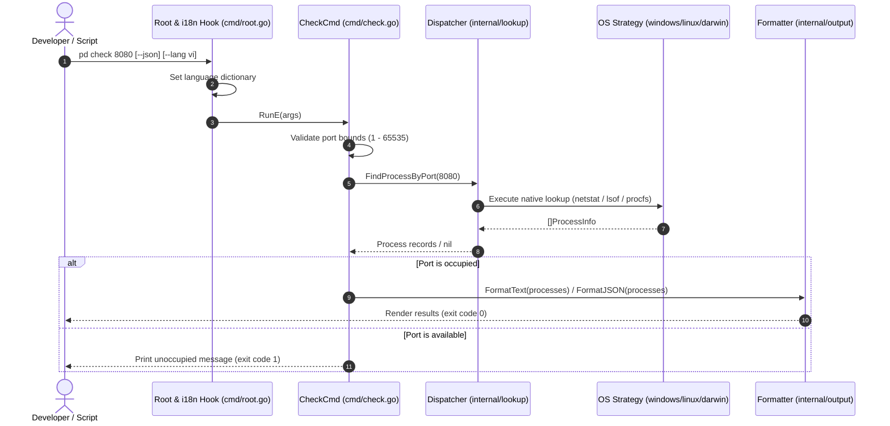
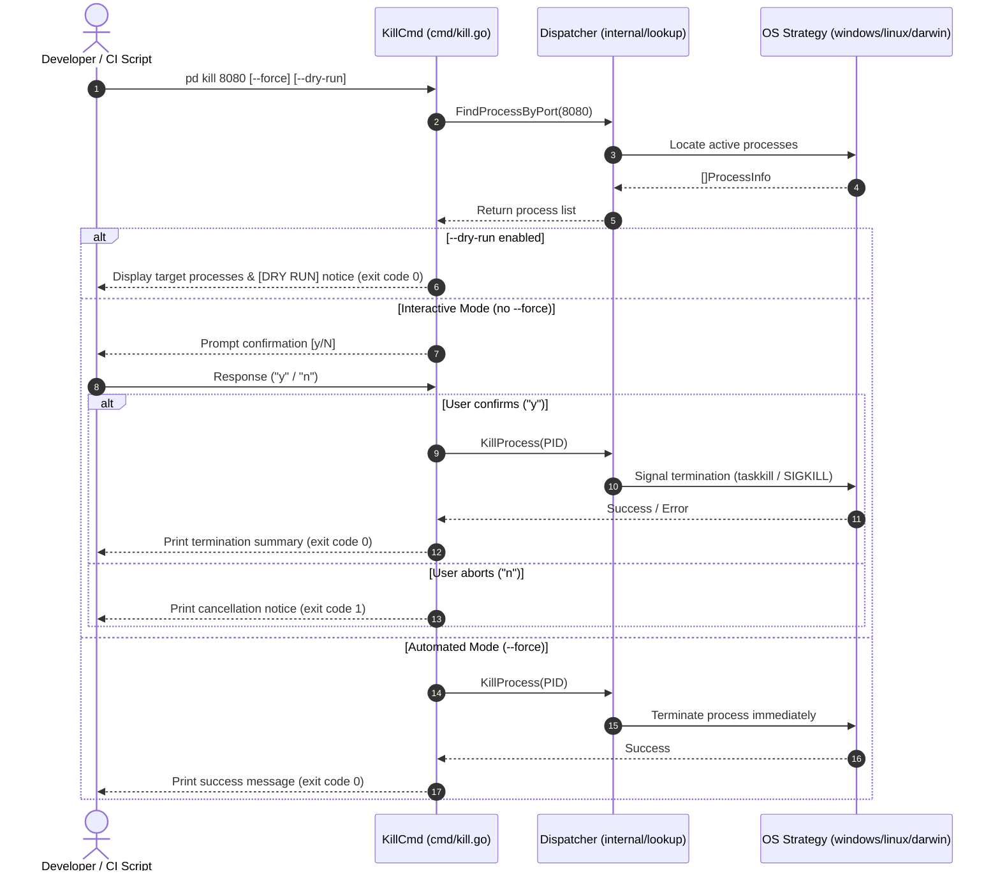
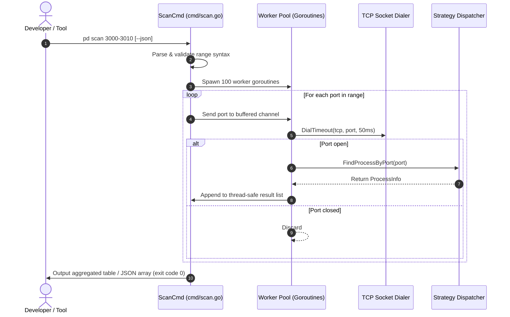

# Business Flow

This document details the operational business workflows and sequence diagrams for Port Detective's primary CLI commands.

---

## 1. Port Investigation Flow (`pd check <port>`)

Executes port discovery, validates port bounds, invokes the platform strategy, and formats the result.

*(source: [cmd/check.go](file:///d:/Project/PortDetective/cmd/check.go), [internal/lookup/lookup.go](file:///d:/Project/PortDetective/internal/lookup/lookup.go))*

---

## 2. Process Termination Flow (`pd kill <port>`)

Terminates target processes with safety verification, dry-run simulation, and PID protection.

*(source: [cmd/kill.go](file:///d:/Project/PortDetective/cmd/kill.go), [internal/lookup/lookup.go](file:///d:/Project/PortDetective/internal/lookup/lookup.go))*

---

## 3. Concurrent Range Scan Flow (`pd scan <start>-<end>`)

Orchestrates multi-threaded port inspection across a designated range.

*(source: [cmd/scan.go](file:///d:/Project/PortDetective/cmd/scan.go))*
