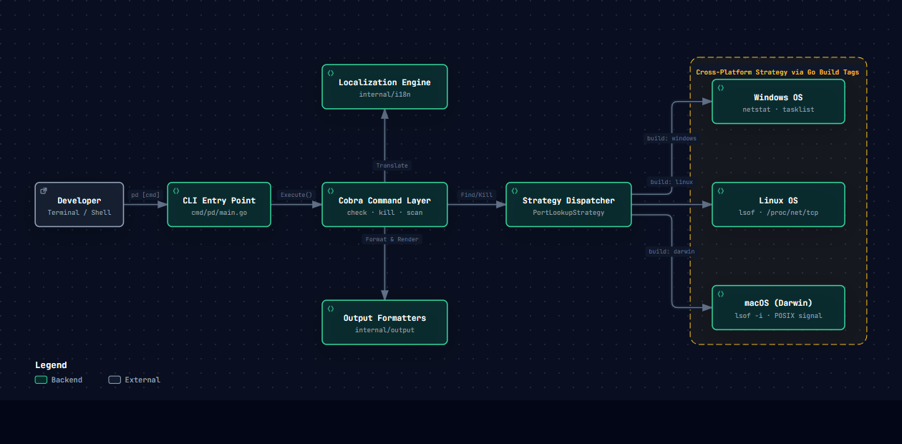

# 📐 System Architecture — Port Detective

<div align="center">

[](../README.md)
[](https://go.dev/)
[](../README.md)

</div>

This document provides a technical deep-dive into the architectural design, core modules, cross-platform strategy, and concurrency models of **Port Detective (`pd`)**.

---

## 1. High-Level Design Principles

Port Detective adheres to four foundational design principles:

1. **Near-Zero Latency & Zero External Runtimes:**
   - Compiles down to a single standalone Go binary without runtime dependencies (no Python, Node.js, or JVM).
   - Execution finishes in sub-10ms for common single-port checks.
2. **Compile-Time Cross-Platform Abstraction:**
   - Employs **Go Build Tags** (`//go:build`) and the Strategy Pattern rather than bulky runtime `if/else` checks, producing target binaries tailored specifically to each operating system.
3. **Strict Separation of Concerns:**
   - **Presentation Layer (`cmd/`)**: Flag parsing, validation, and subcommand execution with Cobra.
   - **Localization Subsystem (`internal/i18n/`)**: Thread-safe message translation dictionaries for English (`en`) and Vietnamese (`vi`).
   - **Strategy Dispatcher (`internal/lookup/`)**: OS-specific socket inspection and process lifecycle management.
   - **Output Formatters (`internal/output/`)**: Colorized terminal human formatters and strict machine-parseable JSON serialization.
4. **Safety by Default:**
   - Every destructive operation (`pd kill`) requires explicit interactive confirmation (`[y/N]`) unless `--force` is intentionally specified.
   - Guarded against accidental termination of critical OS system PIDs (`PID 0` / `PID 4` / `launchd`).

---

## 2. Interactive Vector Architecture Diagram

The system diagram below illustrates the flow from terminal input through Cobra command dispatching, localization, output formatting, and OS-specific socket resolution:

<div align="center">



</div>

> [!NOTE]
> The vector diagram above was generated with [Archify](https://github.com) to visually detail component boundaries, dispatch flows, and Go build tag partitions.

---

## 3. Core Component Walkthrough

### 3.1. Process Data Model (`internal/process`)
The canonical `ProcessInfo` struct acts as the common contract between the lookup strategies and the output renderers:

```go
package process

// ProcessInfo holds runtime metadata about a process listening on a port.
type ProcessInfo struct {
    PID      int    `json:"pid"`
    Name     string `json:"name"`
    Command  string `json:"command"`
    Port     int    `json:"port"`
    Protocol string `json:"protocol"` // "tcp" | "udp"
}
```

---

### 3.2. Cross-Platform Strategy Pattern (`internal/lookup`)

All operating systems adhere to a unified interface defined in [`internal/lookup/strategy.go`](file:///d:/Project/PortDetective/internal/lookup):

```go
type PortLookupStrategy interface {
    FindProcessByPort(port int) ([]process.ProcessInfo, error)
    KillProcess(pid int) error
}
```

#### OS Implementation Breakdown

| Operating System | Implementation File | Primary Mechanism | Fallback Mechanism | Process Kill Method |
| :--- | :--- | :--- | :--- | :--- |
| **Windows** | `windows.go`<br>`//go:build windows` | `netstat -ano` output parser | `tasklist /FO CSV /FI "PID eq <pid>"` | `taskkill /F /PID <pid>` |
| **Linux** | `linux.go`<br>`//go:build linux` | `lsof -i :<port> -sTCP:LISTEN -P -n` | Direct kernel `/proc/net/tcp` socket inode parsing & `/proc/<pid>/fd/` correlation | `syscall.Kill(pid, syscall.SIGKILL)` |
| **macOS (Darwin)** | `darwin.go`<br>`//go:build darwin` | Native `lsof -i :<port> -P -n` | POSIX process validation | `syscall.Kill(pid, syscall.SIGKILL)` |

> [!TIP]
> **Minimal Container Support:** On lightweight Docker images (Alpine / Debian Slim) where `lsof` or `net-tools` are not installed, the Linux strategy automatically parses `/proc/net/tcp` and `/proc/net/tcp6` to extract hex-encoded IP/port addresses and inode numbers, ensuring Port Detective functions inside stripped containers without installing extra packages.

---

### 3.3. Concurrency Model (`cmd/scan.go`)

When scanning ranges (e.g., `pd scan 3000-8000`), Port Detective utilizes a bounded worker pool:

- **Configurable Worker Concurrency:** Defaults to 100 concurrent workers (`--workers 100`).
- **Channel-Based Task Distribution:** Ports are fed through a buffered channel to worker goroutines.
- **Mutex-Protected Output Sync:** Active listener results are aggregated atomically to prevent terminal output race conditions.
- **Microsecond Socket Probing:** High-speed initial TCP SYN handshake identifies open ports before executing full PID inspections.

---

### 3.4. Output & Presentation Layer (`internal/output`)

Port Detective isolates all rendering logic from business logic:

1. **Human-Readable Terminal Tables (`internal/output/text.go`):**
   - High-contrast ANSI colors via `github.com/fatih/color`.
   - Distinct column formatting for PID, Process Name, Port, and Protocol.
2. **Strict Machine JSON (`internal/output/json.go`):**
   - Activated via `--json`.
   - Always outputs clean JSON to `stdout` with errors routed to `stderr`, making it seamless to pipe into `jq` or CI/CD test scripts:
     ```bash
     pd check 3000 --json | jq '.[0].pid'
     ```

---

### 3.5. Localization Engine (`internal/i18n`)

Port Detective provides instant language switching between English and Vietnamese:
- **Resolution Order:**
  1. CLI parameter `--lang <en|vi>`
  2. Environment variable `PORT_DETECTIVE_LANG=<en|vi>`
  3. Operating system environment `$LANG` / `$LC_ALL`
  4. Default fallback: `en`
- Dictionaries are embedded Go maps initialized at package startup for zero I/O latency.

---

## 4. Error Handling & Exit Codes

Port Detective conforms to strict POSIX exit codes for scriptability:

| Exit Code | Meaning | Example Trigger |
| :---: | :--- | :--- |
| `0` | **Success** | Process found, process killed, or scan completed |
| `1` | **No Process / Port Available** | Port is free, or no processes listening |
| `2` | **Permission Denied / Elevation Required** | Root / Administrator privileges needed to inspect system PID |
| `3` | **Invalid Argument** | Invalid port number (outside `1`–`65535`), malformed port range |
| `4` | **System / Strategy Failure** | Kernel or OS command execution failure |

---

## 5. Navigation

- [📖 CLI Reference Guide](./cli-reference.md)
- [📦 Installation Guide](./installation.md)
- [🤝 Contributing Guide](./contributing.md)
- [🏠 Project Root & README](../README.md)
